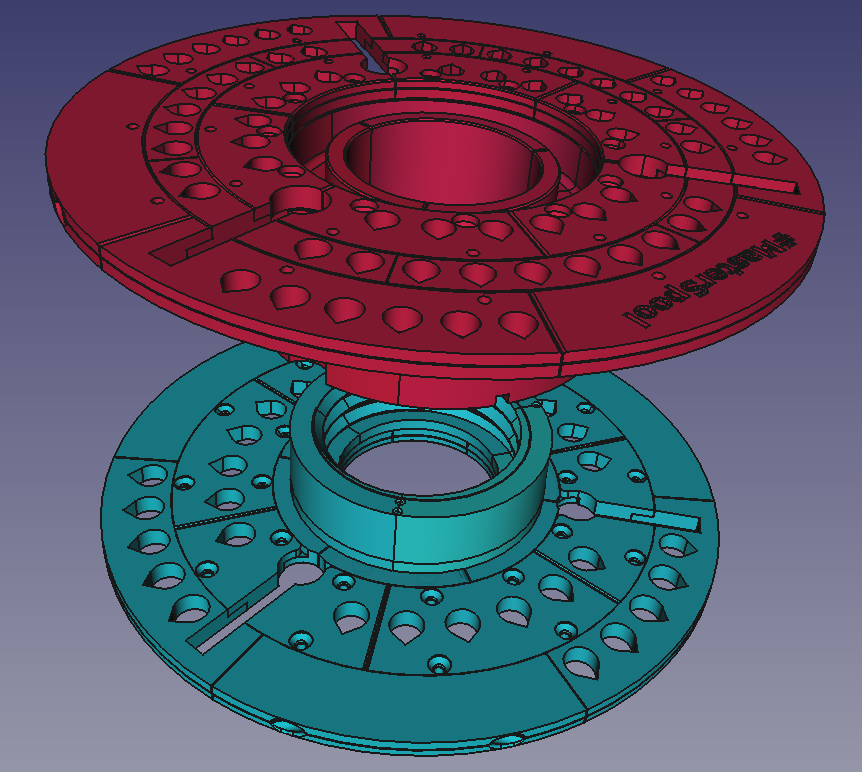

# MasterSpool

A variant of @RichRap's #MasterSpool universal FFF filament spool holder designed to be printed in parts on a small-bed machine such as RepRap Fisher (https://reprapltd.com/shop/reprap-fisher-delta-3d-printer/).

Each STL in the STLs directory has a file name that includes the number off that you need to print for one spool.

This needs 27 x (12mm M3) countersunk screws and 48 x (6mm M3) countersunk screws to hold it together.  The screws self-tap into holes in the design.
